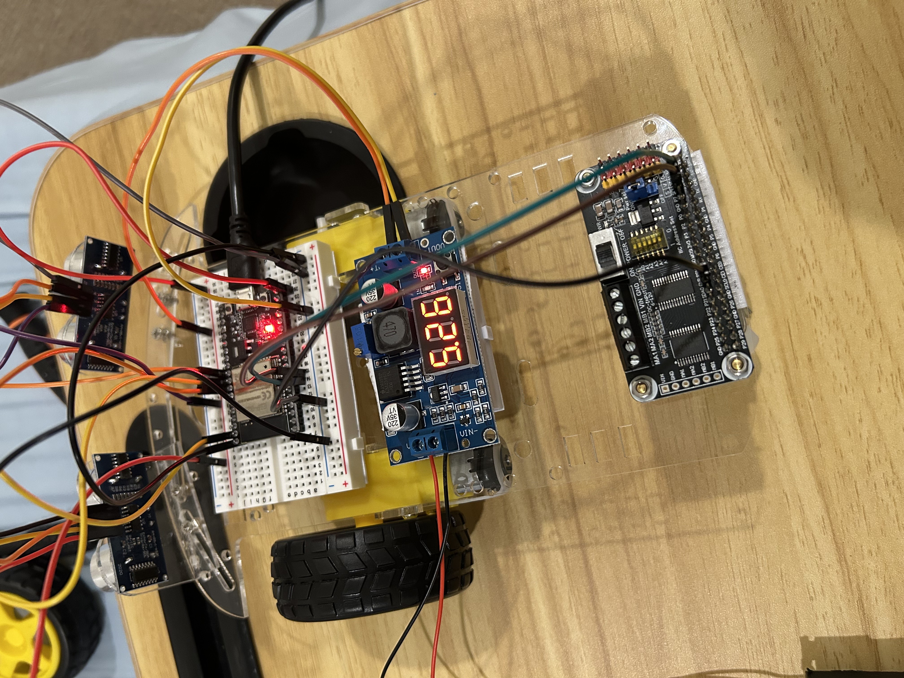
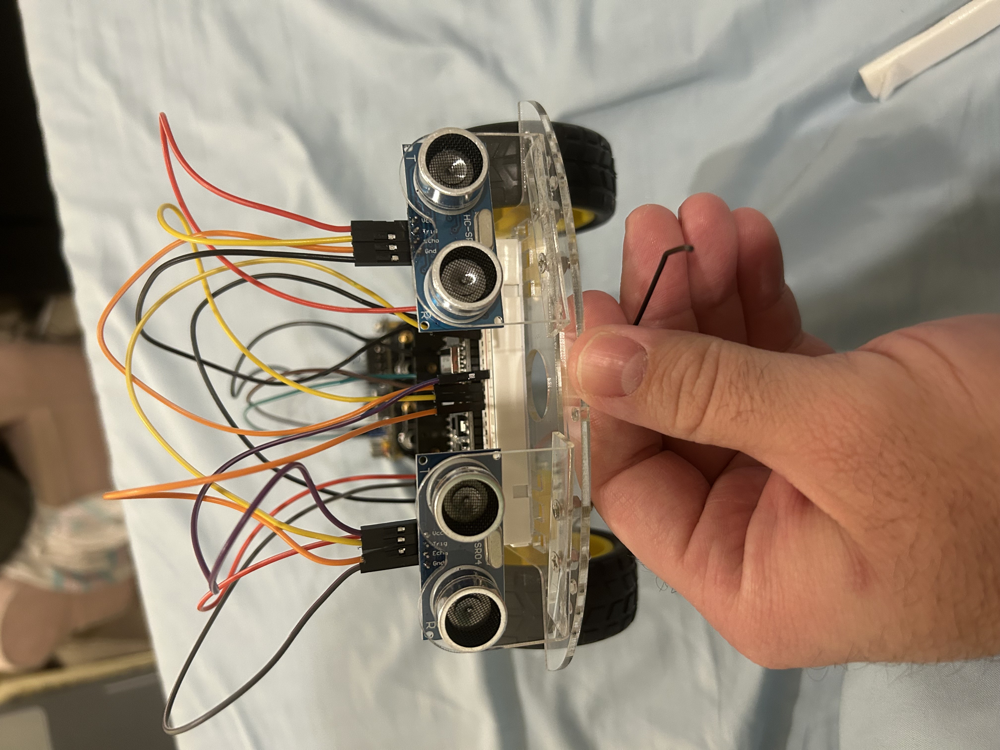
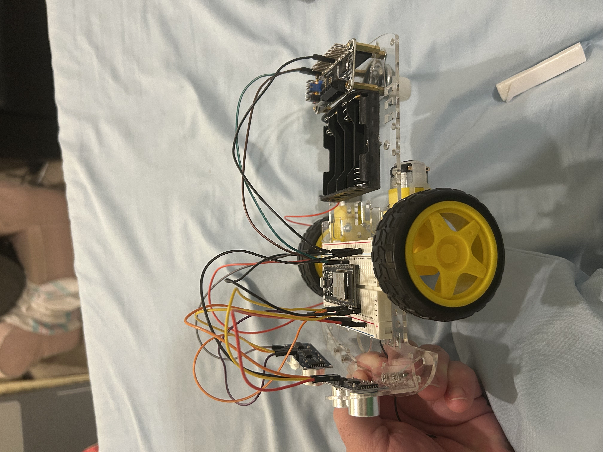

# Echo

Echo began as a low-cost method of practicing embedded programming. I intended to create a semi-smart robot car that could sense and avoid obstacles, and later be upgraded with a thermal sensor to use as a way to track human movement and follow a target.

## Setup
I started with a simple ESP32 dev board, two HC-SR04 ultrasonic sensors, a PCA9685 Motor HAT, and an LM2596 buck converter.

Wiring up the components went really well, and power reached all components cleanly, as seen by the screenshots below:

And that was when my success screeched to a halt. Through a myriad of tests and seemingly endless troubleshooting, it appears my dev board was damaged in some way. It was incapable of moving anything over I2C, much less flashing. Due to this, I am simply dropping the project here for now, until I can acquire new parts for a redesign, and try again. Echo 2.0 coming soon!