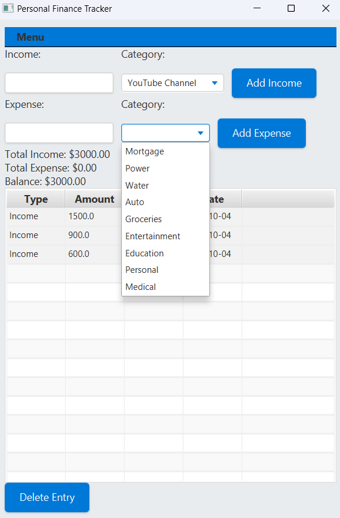

# Finance Tracker Application

## Vision
The **Finance Tracker Application** is designed to be a light-weight, persistent application that tracks the typical
expenses of a young Software Engineer. This application is small, efficient, and styled so that
it looks professional, and at-home on any machine. It is not designed to function as a mobile
application at this time. This application is a display of Java, FXML and CSS design and coding ability, as well
as a display of how to properly handle data, so that it may be accessed and modified in real-time.

## Features
- **Add Income**: Users can enter their income amounts, categorize them, and see a real-time update of their total income.
  Currently, there are three options for income.
- **Add Expense**: Users can track their expenses by entering the amount and selecting a category,
  with instant updates to the expense summary.
- **View Summary**: The application provides a summary of total income, total expenses, and current balance,
  giving users a quick overview of their financial status.
- **Transaction History**: Users can view a table of all transactions, making it easy to track past entries.
- **Delete Transactions**: Users can select and remove any transaction from their history.
- **Save and Load Data**: The application allows users to save their transaction data to a file and load it back,
  ensuring that all information is retained across sessions.

## Screenshots


*Main screen of the Finance Tracker Application showing overall layout.*


*Showing the Income drop-down box, displaying the highlighting feature.*




*Showing the Expenses drop-down box.*


*Showing the populated table.*


*Showing the menu controls, including keyboard shortcuts.*


*Showing the secondary window displayed when "Show Totals" is clicked.*


*Showing the popup window for a successful save.*


*Showing the popup window for a successful load.*

## How to Access the Application
1. **Clone the Repository**:
   To access the application, first, clone the repository using the following command:
   ```bash
   git clone https://github.com/Ryanrzr0091/CPSC2710/tree/branch7.git